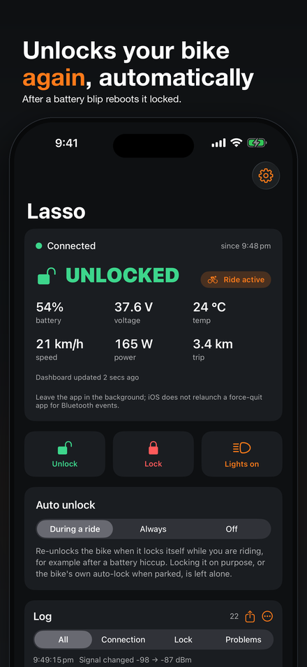
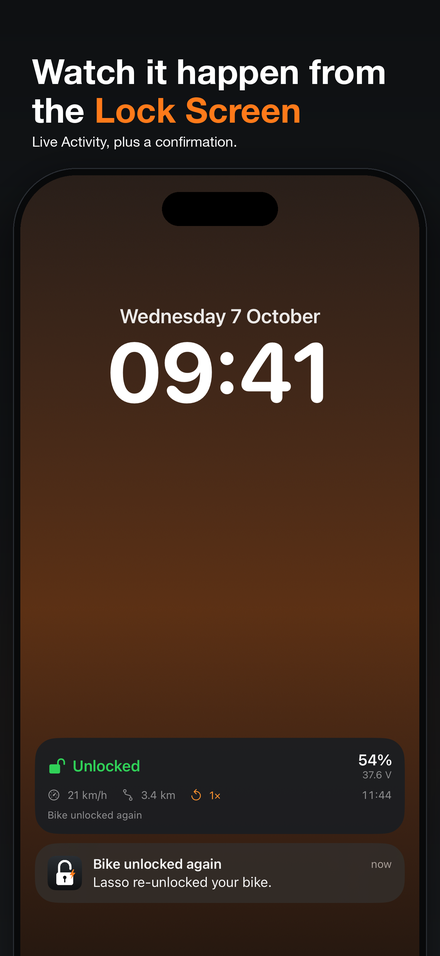
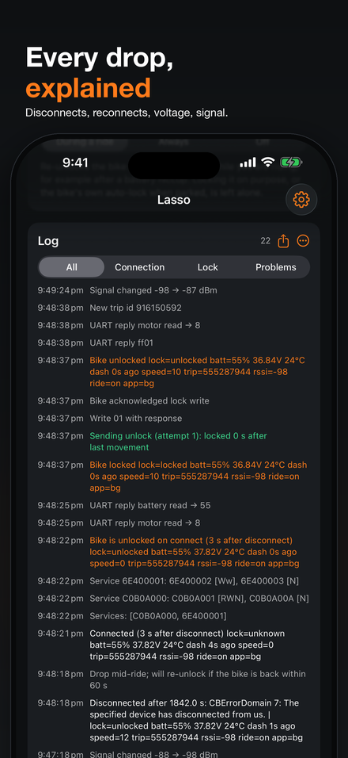
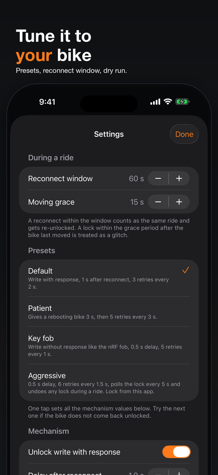

# Lasso

Your Cowboy e-bike unlocks itself again, automatically.

Lasso is made for one specific problem: a Cowboy with a **faulty battery**.
When cells are out of balance, worn, or a contact is tired, the pack can cut
out for a moment under load. The bike loses power, reboots locked, drops the
Bluetooth connection, and the motor is gone. The official app's Auto Unlock
does not kick in again mid-ride, so you stop and hold the button in traffic.
Lasso keeps a Bluetooth connection to the bike in the background, notices the
drop, and sends the unlock within about a second of the bike coming back.

A new battery is the real fix. Lasso is the cheap way to keep riding the old
one safely until then, and its log shows how often the pack actually drops.

Website: https://lasso-bike.vercel.app · Support: https://lasso-bike.vercel.app/support

<p align="center">
  
  
  
  
</p>

> **Tested only on a Cowboy 3** (firmware 4.21.5). Cowboy 4, Cruiser and
> newer models expose the same lock mechanism as far as public reverse
> engineering shows, but nobody has verified Lasso on them yet. If you try it
> on another model, please open an issue with the log, whatever the result.
>
> Lasso is an independent app. Not affiliated with, endorsed by or sponsored
> by Cowboy SA. Cowboy is a trademark of Cowboy SA.

## What it does

- **Automatic re-unlock.** In *During a ride* mode (default) Lasso only undoes
  locks that happen while you are riding or right after a reconnect, so a
  lock on purpose or the bike's own auto-lock when parked is respected.
  *Always* unlocks on every connect. *Off* only watches and logs.
- **Live Activity.** Lock state, battery, voltage, speed, distance and the
  number of re-unlocks on the Lock Screen and in the Dynamic Island while a
  ride is active. A notification confirms every re-unlock (can be turned off).
- **Manual buttons.** Unlock, Lock and Lights, always available.
- **Log.** Every connect, disconnect, drop and lock change with error codes,
  link uptime, signal strength, battery, voltage and app state. Share it as a
  text file from the Log card.
- **Mechanism presets.** If the default write does not bring your bike back,
  try *Patient*, *Key fob* or *Aggressive* without rebuilding the app.

## Setting it up

1. **Pair once in the official Cowboy app.** The bike requires an
   authenticated Bluetooth bond with a passkey. iOS stores that bond
   system-wide, so Lasso reuses it. No code, no Cowboy account in Lasso.
2. **Install Lasso and tap Scan.** The bike shows up by name, usually marked
   *linked* because the official app is already connected to it. Tap it.
3. **Allow notifications and Live Activities** when asked. Both are optional.
4. **Pick a mode.** *During a ride* is right for almost everyone.
5. **Leave Lasso in the background.** iOS wakes it for Bluetooth events even
   when it is not on screen, and relaunches it if memory got tight. It does
   not wake a force-quit app, so do not swipe it away. Idle Bluetooth costs
   almost no battery.

Lasso and the official app coexist: iOS shares one Bluetooth link between
them. No bike nearby? Tap *Try with a demo bike* on the pairing screen to see
the app with a fake bike and a real log of a battery drop being fixed.

If something does not work, export the log from the Log card and attach it to
an issue or a support email. It contains the bike's Bluetooth identifier, lock
events and signal strength, nothing else.

## Price and licence

Lasso on the App Store has a **7-day free trial**, then a **one-time Lifetime
purchase**. No subscription. After the trial, automatic re-unlock pauses until
you buy; the manual buttons, the Live Activity and the log keep working.

The code is **GPLv3** (see [LICENSE](LICENSE)). Building it yourself gives
you the complete app with every feature on: the purchase screen only exists
when a RevenueCat key is supplied at build time. Buying it on the App Store
supports the project and saves you a Mac and a developer account.

## How it talks to the bike

The bike exposes a lock characteristic (write `01` to unlock, `00` to lock;
it notifies every change), a protobuf dashboard stream (speed, battery,
voltage, ...) while unlocked, and a Nordic UART that carries Modbus RTU frames
to the main PCB (lights, auto-lock, PCB reboot). Lasso only writes the lock
byte and the lights register; it never touches motor controller settings.

A ride starts when the bike is seen unlocked. If the link drops and comes
back within 60 s with the bike locked, that is a reboot, and it gets
unlocked. A lock notification within 15 s of the bike moving is treated the
same way. A lock at standstill, or a reconnect after a longer absence, ends
the ride and is respected.

The byte-level reference, written so it can be implemented on any platform,
is in [docs/protocol.md](docs/protocol.md). Protocol knowledge comes from
[Bronco Unleashed](https://github.com/runerune/BroncoUnleashed),
[Cowboy Untamed](https://github.com/Imaginous/Cowboy_Untamed) and
[cowboyunleashed](https://github.com/mmmago/cowboyunleashed).

## Build it yourself

```sh
brew install xcodegen
cd ios
xcodegen generate
open Lasso.xcodeproj
```

Set your own team in `ios/project.yml` and run on a real iPhone; Bluetooth is
not available in the Simulator. The Xcode project is generated and not
checked in. In the Simulator, launching with `-demo` shows the fake bike, and
`ios/scripts/screenshots.sh` runs the UI tests that capture the screenshots
above.

To build with purchases enabled, copy `ios/Secrets.xcconfig.example` to
`ios/Secrets.xcconfig.local`, put your RevenueCat key in it and pass
`-xcconfig Secrets.xcconfig.local` to `xcodebuild`.

## Repository layout

| Path | What |
|---|---|
| `ios/` | The iOS app (`App/`, `Shared/`, `Widget/` Live Activity, `Resources/`, `UITests/`, `scripts/`) |
| `android/` | Placeholder for the planned Android port |
| `docs/` | [Protocol reference](docs/protocol.md) and the images above |

Contributions are welcome, see [CONTRIBUTING.md](CONTRIBUTING.md).
